# Moonlit Echoes Theme for SillyBunny

**English** | [繁體中文](.github/README-zh_Hant.md)

> [!IMPORTANT]
> This repository is a **SillyBunny-specific fork** of [RivelleDays/SillyTavern-MoonlitEchoesTheme](https://github.com/RivelleDays/SillyTavern-MoonlitEchoesTheme).
> Install this fork only if you are using **SillyBunny**.
> For vanilla SillyTavern, use the upstream Moonlit Echoes repository instead.
>
> Fork issues, SillyBunny layout bugs, and compatibility reports should be directed to **purachina** on GitHub through this repository:
> <https://github.com/SillyBunnyTeam/SillyBunny-MoonlitEchoesTheme/issues>

I keep this fork as a standalone third-party SillyBunny extension. SillyBunny owns the navigation, composer sizing and chat layouts; Moonlit supplies their theme styling. The optional bundled-file installers need host support, as explained below, but the theme itself doesn't require core changes.

SillyBunny note: Echo, Whisper, Hush, Ripple and Tide are built into SillyBunny core now, so I've taken their layout selection out of this extension. Both halves used to fight over the same dropdown, which meant your chat style didn't survive a refresh. Pick them from Appearance or the slash commands as before. Rivelle's original 'Glimmer' and 'Moonlit Echoes' UI exports still carry `chat_display: 0`, so importing those drops you back to Flat. The generated Regex Agent palette companions leave your chat layout alone.

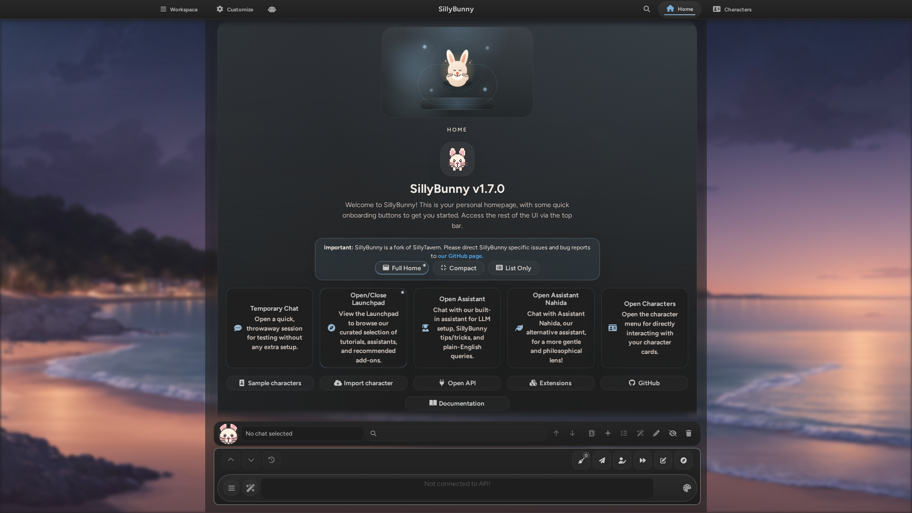

**Moonlit Echoes 月下回聲** is a UI theme originally designed for SillyTavern. This repository adapts it for **SillyBunny** while preserving the upstream theme's modern, elegant, minimalist interface and desktop/mobile experience.

Rivelle first released Moonlit Echoes on the SillyTavern Discord server on November 25, 2024, then made it an open-source SillyTavern extension. I maintain the SillyBunny-specific changes in this fork; the original theme and its author credit remain hers.

| UI Interface | System Messages |
|----------------------|-------------------|
| 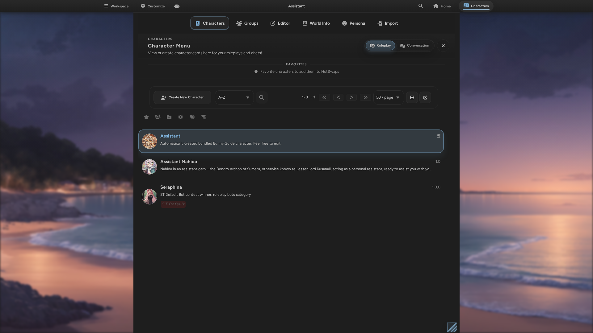 | 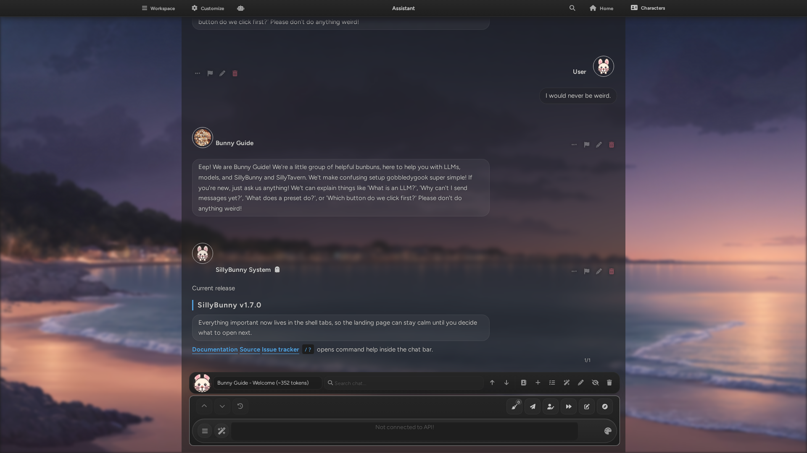 |

## Features

### Core Features
- **Multiple Message Styles**: Moonlit styles SillyBunny's native 'Flat', 'Bubble', 'Document', 'Echo', 'Whisper', 'Hush', 'Ripple' and 'Tide' layouts. SillyBunny handles their selection and persistence.
- **Desktop and Mobile**: Theme colours and appearance settings for both. Options marked 'Legacy' don't replace SillyBunny's native composer or navigation sizing.

### Moonlit Echoes Theme Presets
You can share Moonlit colour schemes as presets and sync them with matching SillyBunny UI themes. I keep the two preset formats separate, so import each into its own menu.

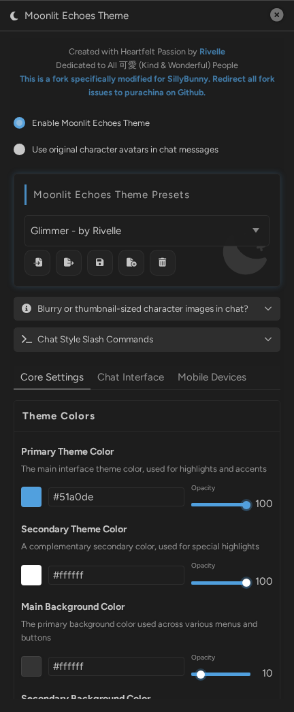

#### Bundled Regex Agent Theme Palettes

Moonlit Echoes includes palette companions for all 78 themes from [SillyBunny Regex Agent Themes](https://github.com/SillyBunnyTeam/SillyBunny-Regex-Agent-Themes): 37 light, 38 dark, and 3 adaptive. They are added to the Moonlit preset menu once without replacing the active preset or any existing preset with the same name. Deleting one keeps it deleted on later starts.

The 75 fixed light and dark presets have matching SillyBunny UI themes. Use the palette button in the Moonlit preset toolbar to install the missing ones, then reload SillyBunny; existing themes with the same name are skipped. To reinstall or update the bundled UI themes, use the labelled **Reinstall / Update Bundled UI Themes** button below the toolbar, confirm the overwrite, then reload SillyBunny; only same-name bundled themes are replaced. The 3 adaptive presets intentionally have no UI companion because they follow the currently active SillyBunny colours.

Use the image button beside it to install all 158 bundled backgrounds. Existing background files are skipped and never overwritten; reload SillyBunny after the install. Backgrounds are not changed when presets change unless you check **Use matching scene background when switching presets**. That option is off by default, and only the matching scene images are selected automatically; textures and the two general backgrounds remain manual choices.

These optional safe installers require a host with `POST /api/themes/create` and `POST /api/backgrounds/upload-new`. Those host changes are separate and aren't merged yet; updating this extension doesn't add the routes. Existing filenames return HTTP 409 and are skipped. On older hosts, a missing route (HTTP 404) stops the install safely, without falling back to an overwrite. The explicit **Reinstall / Update Bundled UI Themes** action still uses `POST /api/themes/save` after your confirmation. You can keep using the theme and import files manually without the new routes.

Every preset is also available as an individual `[Moonlit] ...json` file in [`theme/`](theme/), alongside the unprefixed UI theme files, for manual import or sharing.

These companions translate palettes only. Regex Agent Themes remains responsible for its tracker-local typography, frames, ornaments, scanlines, and animation. Both projects are AGPL-3.0, and generated names retain the source author credit.

Regenerate or verify the committed catalogue from sibling checkouts with:

```bash
node tools/generate-regex-agent-presets.mjs
node tools/generate-regex-agent-presets.mjs --check --source=../SillyBunny-Regex-Agent-Themes
node --test test/*.test.mjs
```

The tests need Node.js 24 or newer. The [checks workflow](.github/workflows/checks.yml) checks out Regex Agent Themes at `3c8e708f8c86e77a92f23526c738e87c82df98c9` (v1.0.1) beside this repository, then checks syntax, locale JSON, tests and generated files. It doesn't install packages or run the screenshot tool.

## Screenshots

The existing screenshots below were taken in **SillyBunny v1.7.0** running this fork, with Rivelle's **'Glimmer (微光)'** UI theme and its matching Moonlit preset applied. They were captured from SillyBunny. The [capture tool](tools/capture-sillybunny-screenshots.js) can refresh the set using a disposable test instance.

### Refreshing the Screenshots

I only use disposable test data for this. Start a separate SillyBunny instance with its own test data directory, no private chats, and the stock Bunny Guide (`default_SillyBunnyGuide.png`). Prepare the Glimmer UI theme and the background in that profile first. A fresh browser window doesn't make a real account safe to capture: Home and Characters can expose account data too.

The tool requires `--disposable-test-profile` as an explicit acknowledgement. It changes host theme, preset and background settings and writes PNG files; it doesn't restore those settings. The flag can't detect whether your account is actually disposable. It selects and verifies Bunny Guide before capture, and stops if the chat identity changes. The temporary system message is display-only, never added to chat history, and its exact element is removed even if setup or capture fails.

```bash
node tools/capture-sillybunny-screenshots.js --help
node tools/capture-sillybunny-screenshots.js --disposable-test-profile --url=http://127.0.0.1:4444 --sillybunny=/path/to/SillyBunny --out=/tmp/moonlit-shots
```

`--help` needs no host or Playwright. Use either `--desktop-only` or `--mobile-only` to limit the set, never both. Playwright must already be available from the supplied checkout or your environment.

### Chat Styles

All eight message layouts are native to SillyBunny. Moonlit supplies the styling shown here. Every shot uses the same conversation so you can compare the styles.

**Flat**
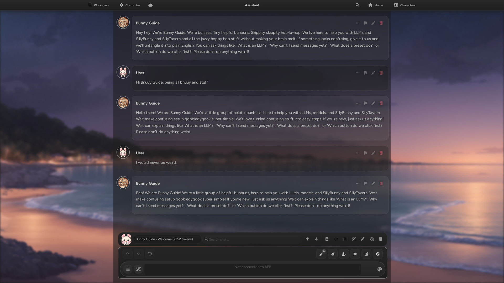

**Bubble**
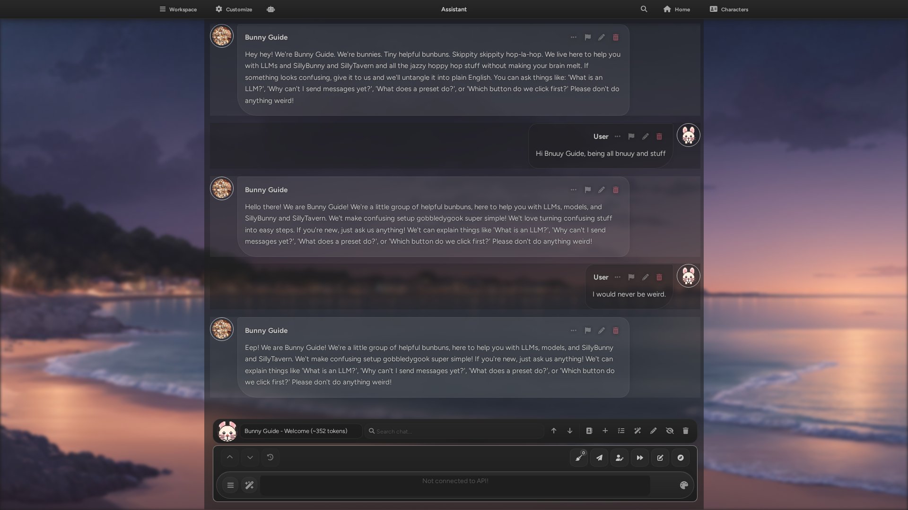

**Document**
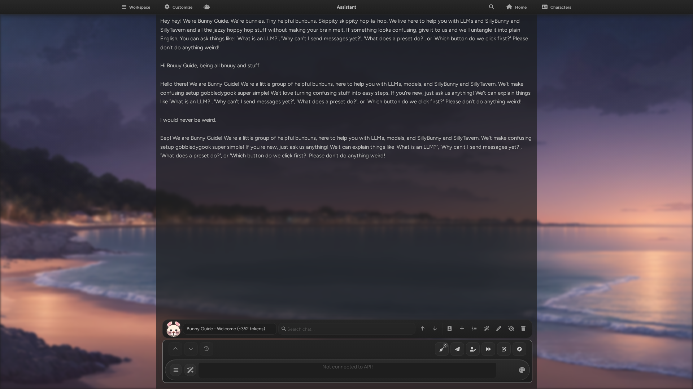

**Echo** - originally a Moonlit style, now a native SillyBunny layout
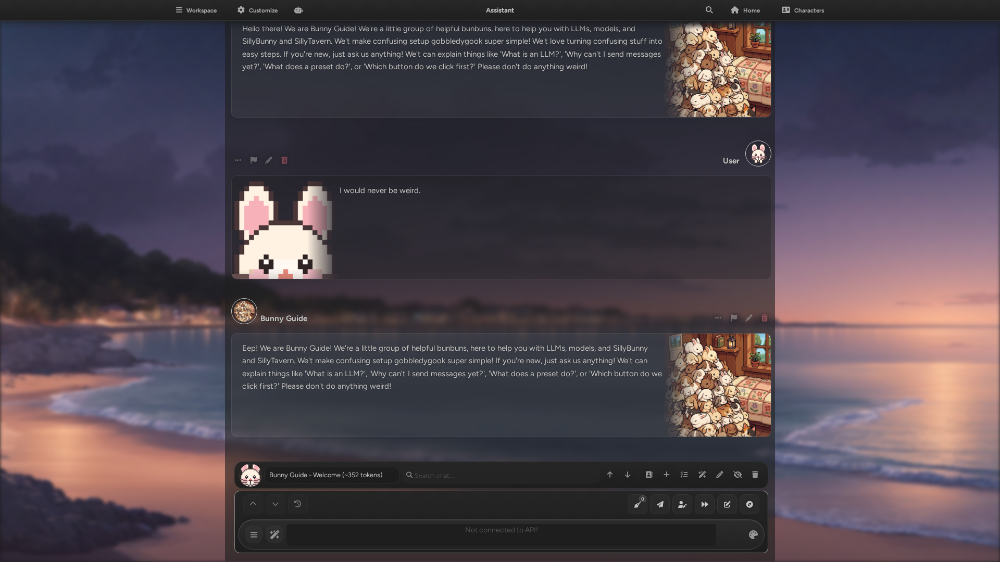

**Whisper**
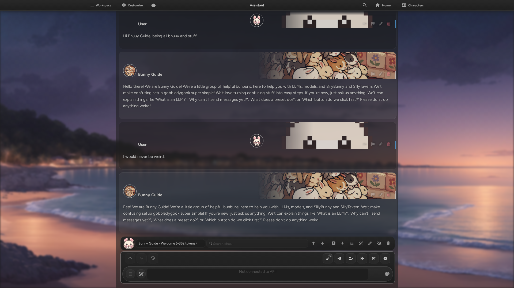

**Hush**
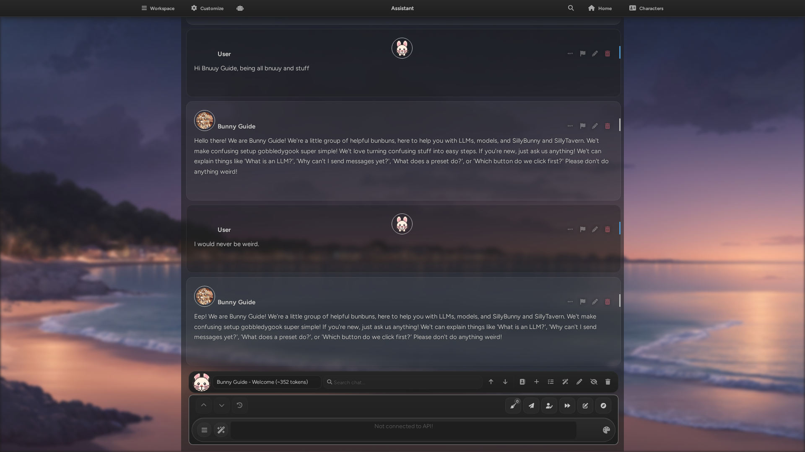

**Ripple**
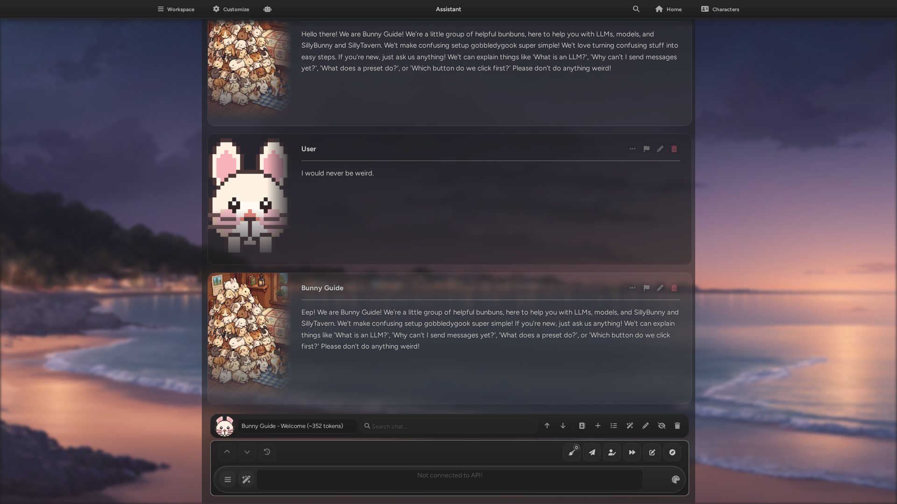

**Tide**
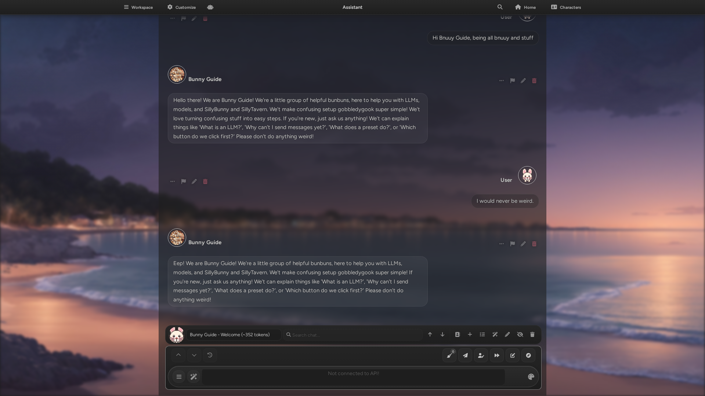

### On Mobile

| In Chat | Theme Settings |
|----------------------|-------------------|
| 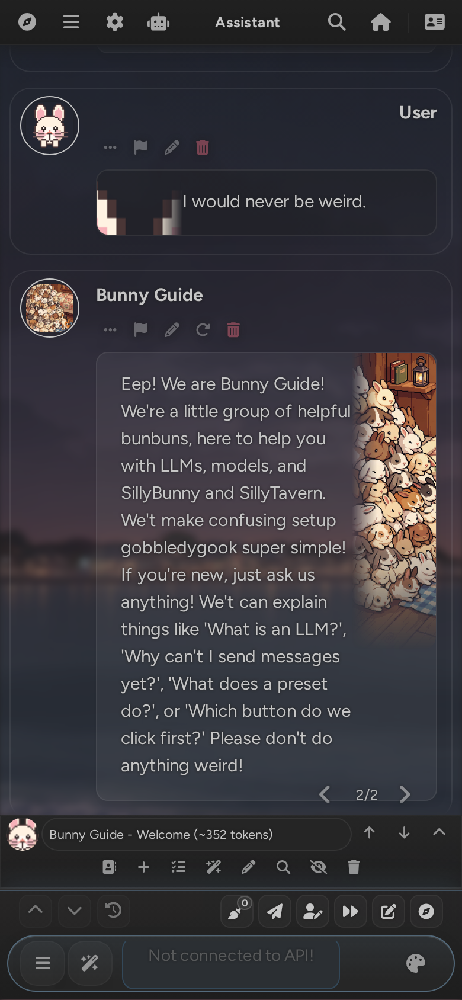 | 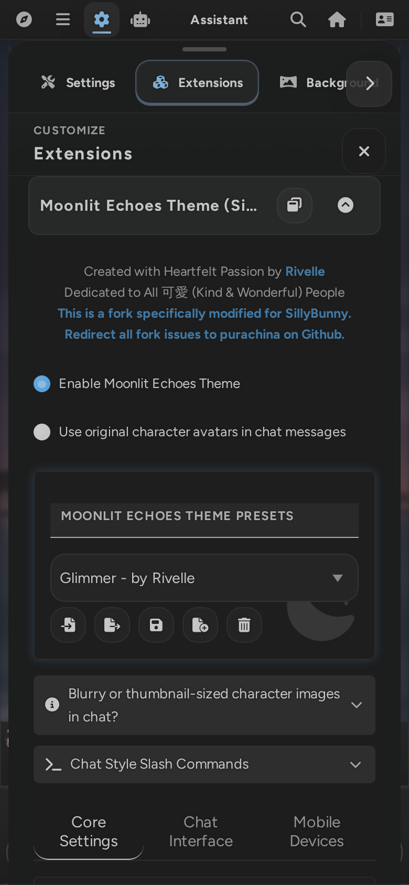 |

<details>
<summary><b>Rivelle's original preview (vanilla SillyTavern)</b></summary>

<br>

These are the upstream showcase images from **version 2.5.0**, taken on a MacBook using Chrome and iPhone Safari, showcasing the "Glimmer (微光)" theme introduced in 2.5.0. They are Rivelle's own compositions and are kept here as she made them—they show Moonlit Echoes on vanilla SillyTavern rather than on SillyBunny.


| UI Interface | System Messages |
|----------------------|-------------------|
|  |  |


</details>

# Installation
## Prerequisites
Use the **latest version of SillyBunny** along with Google Chrome.

If you are not using SillyBunny, install the upstream SillyTavern version instead:
<https://github.com/RivelleDays/SillyTavern-MoonlitEchoesTheme>

## Installation Steps

### 1. **Install the SillyBunny fork of Moonlit Echoes Theme**
In the **SillyBunny Extension Manager**, use "Install from URL" and paste the following Git URL:
   ```
   https://github.com/SillyBunnyTeam/SillyBunny-MoonlitEchoesTheme
   ```

### 2. **Update `/SillyBunny/config.yaml` for thumbnail settings**
Previously, I recommended disabling thumbnails, but this can slow down image loading on mobile. Here’s a tested configuration I now recommend:
```
thumbnails:
  enabled: true
  format: png
  quality: 100
  dimensions:
    bg:
      - 240
      - 135
    avatar:
      - 864
      - 1280
```
Before applying and restarting SillyBunny, consider deleting the entire thumbnails folder (likely located at `/SillyBunny/data/default-user/thumbnails`) Don’t worry—it will regenerate automatically with better image quality after restart.

### 3. **Download and Enable the Theme (Highly Recommended!)**

The Moonlit Echoes theme extension is ready to use after installation. However, if you’d like your interface to match the style shown in the preview images, please download the theme file and import it into your User Settings, then set it as your UI theme.

The newly added **"Glimmer (微光)"** theme in version 2.5.0 is especially recommended. This theme was specially designed for this release—minimalist, versatile, and perfect for using your phone under the covers at night.
You can find it in the GitHub theme folder or download it directly below:

- [Glimmer - by Rivelle.json](https://github.com/SillyBunnyTeam/SillyBunny-MoonlitEchoesTheme/blob/main/theme/Glimmer%20-%20by%20Rivelle.json) → for SillyBunny User Settings
- [[Moonlit] Glimmer - by Rivelle.json](https://github.com/SillyBunnyTeam/SillyBunny-MoonlitEchoesTheme/blob/main/theme/%5BMoonlit%5D%20Glimmer%20-%20by%20Rivelle.json) → for Moonlit Echoes Theme Presets

No need to tweak anything—just drop the file in and you’re good to go!

## Upstream SillyTavern / Termux Note 📱
This fork is maintained for SillyBunny. If you are using vanilla SillyTavern via Termux, install the upstream Moonlit Echoes repository instead.

If you still need the original Termux guidance, here’s how upstream SillyTavern users can modify `config.yaml`.

> [!Warning]
> I don’t have experience with Android devices or Termux, so I can’t answer related questions, test the steps, or guarantee results. The following methods are provided by other users.

> [!NOTE]
> You may find two config.yaml files inside the SillyTavern folder. Make sure to edit the one in the root directory: `/SillyTavern/config.yaml.` **Do NOT modify** `/SillyTavern/default/config.yaml` or anything inside the default folder.

### Method 1: Edit via Termux
1. Open Termux and enter: `cd SillyTavern`
2. Then, run: `nano config.yaml` to edit the file.

### Method 2: Use Material Files (Android File Manager)
1. **Open Material Files** > **Add Storage** > **Navigate to Termux** > **SillyTavern**
2. Within the SillyTavern directory, edit `config.yaml` directly

# Usage Guide

## How to Use the Moonlit Echoes Theme Preset?
Moonlit Echoes presets can sync with SillyBunny UI themes when both menus have matching names. Switching either one applies the matching settings when the extension is enabled.

The formats remain separate. Switching or importing a Moonlit preset doesn't create a native UI theme file. The optional install button creates missing bundled UI themes; **Reinstall / Update Bundled UI Themes** can replace same-name files after confirmation.

### Import & Export
- Moonlit Echoes theme preset files follow the format `[Moonlit] PresetName.json` (e.g., `[Moonlit] Honey Cream.json`). There is a half-width space after `[Moonlit]`
- This does not affect functionality. You do **NOT** need to remove `[Moonlit] ` before importing—just import the file directly
- If the imported preset does not sync with SillyBunny UI themes, **reload the page** or **select a different theme** to apply the changes

## FAQ

### Q: The layout looks broken or doesn’t work with other extensions?
**A:** Yes, despite my best efforts, I can’t guarantee full compatibility with every third-party SillyTavern extension. If you run into any issues, please try the following troubleshooting steps:

1. Make sure you're using the latest version of SillyBunny with the latest version of Chrome.
2. Temporarily disable this theme extension to check whether it’s the cause.  
   If it is—or if the third-party extension you're using isn't supported yet—feel free to report it.

Moonlit Echoes is a third-party theme extension and is not affiliated with the official SillyTavern project. It’s a personal project born out of love for SillyTavern and a strong preference for visual design. If you encounter any issues, please reach out to me first—I’ll do my best to help.

### Q: What other extensions are you using in the preview images?
**A:** The SillyBunny screenshots at the top are a stock SillyBunny install with only this theme enabled, so nothing there is doing any extra work. Rivelle's original preview images use the extensions below—the ones she highly recommends and can confirm are fully supported by Moonlit Echoes:
- **[SillyTavern / Extension-TopInfoBar](https://github.com/SillyTavern/Extension-TopInfoBar)**: Official extension. Lets you quickly switch chats, jump between files, and search messages. My absolute favorite—highly recommended!
- **[SillyTavern / Extension-QuickPersona](https://github.com/SillyTavern/Extension-QuickPersona)**: Official extension. Easily switch personas from the chat input area, with stylish visual cues.
- **[SillyTavern / Extension-TypingIndicator](https://github.com/SillyTavern/Extension-TypingIndicator)**: Official extension. Shows a cute `{{char}} is typing...` indicator while characters are responding.
- **[zerofata / SillyTavern-Dialogue-Colorizer-Plus](https://github.com/zerofata/SillyTavern-Dialogue-Colorizer-Plus)**: A fork of the original [SillyTavern-Dialogue-Colorizer](https://github.com/XanadusWorks/SillyTavern-Dialogue-Colorizer), with improved variable support for customizing character dialogue colors.
- **[qvink / SillyTavern-MessageSummarize](https://github.com/qvink/SillyTavern-MessageSummarize)**: Adds smart summarization to simulate long- and short-term memory for LLMs—very powerful and useful.
- **[LenAnderson / SillyTavern-MoreFlexibleContinues](https://github.com/LenAnderson/SillyTavern-MoreFlexibleContinues/)**: Adds more flexibility to continue generations.
- **[splitclover / rewrite-extension](https://github.com/splitclover/rewrite-extension)**: Allows fast partial rewrites and deletions of message content.

### Q: Experiencing a lag when switching themes with Moonlit Echoes?
**A:** Yes, this is a known issue I haven’t been able to resolve yet. On mobile, the switch may freeze briefly for a few seconds before completing. Just wait a moment and it should load fine. This rarely happens on desktop.

# Feedback & Suggestions
For this SillyBunny fork, submit issues and feature requests here:
<https://github.com/SillyBunnyTeam/SillyBunny-MoonlitEchoesTheme/issues>

Please direct vanilla SillyTavern/upstream Moonlit Echoes issues to the original project instead.

You’re also welcome to share your color schemes in the Discussions section!<br>
Whether it’s a SillyTavern UI theme or a Moonlit Echoes theme preset, I’d love to see your creative designs.

# Special Thanks

A heartfelt thank you to everyone who has supported and contributed to this project.

- A big thank you to ceruleandeep for your early support in the SillyTavern Discord—this all started because of you.
- Huge thanks to IceFog72 for encouraging me to create SillyTavern themes and for developing [SillyTavern-CustomThemeStyleInputs](https://github.com/RivelleDays/SillyTavern-MoonlitEchoesTheme), which saved me a lot of hassle in the early stages.
- Much appreciation to Bronya-Rand for your open-source work—I learned a lot from your SillyTavern extension and took inspiration from its feature layout.
- Thanks to vesper—I drew inspiration from your custom themes when designing the Ripple message style.

Finally, endless gratitude to Wolfsblvt and Cohee for adding i18n support for third-party extensions in SillyTavern. This has greatly improved the experience for non-English users, and I truly appreciate it!

# License
AGPLv3
